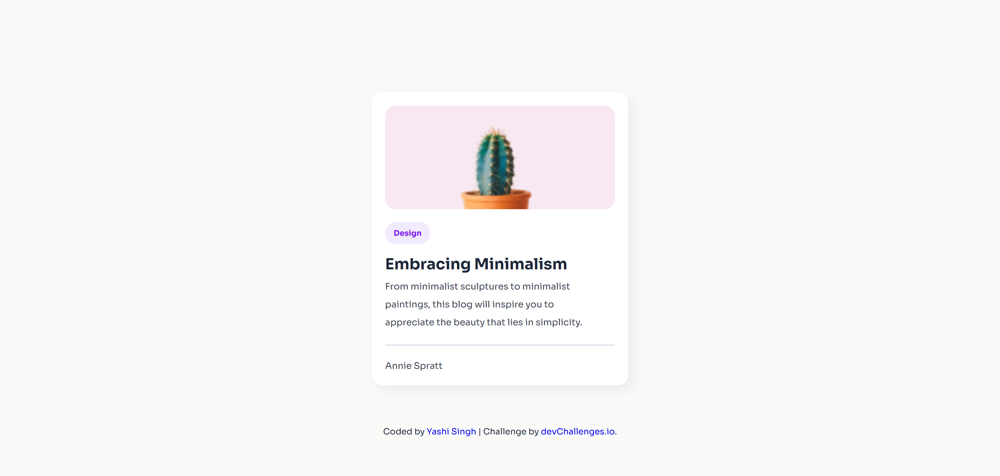
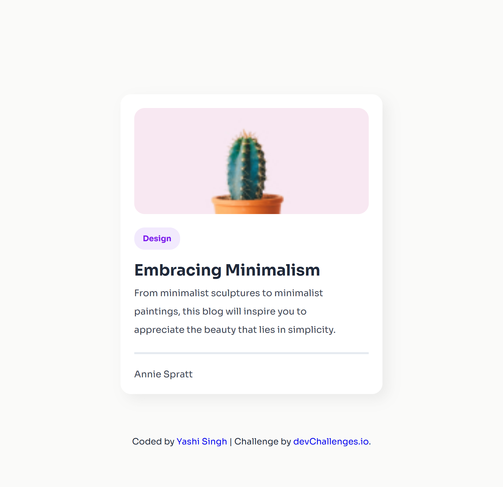
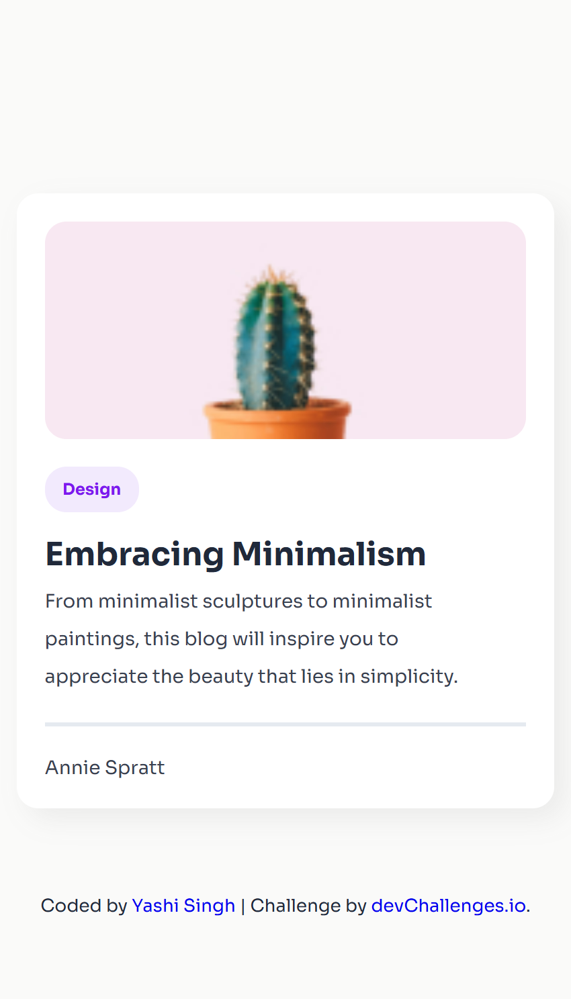

<h1 align="center">Minimal Blog Card | devChallenges</h1>

  Solution for the <a href="https://devchallenges.io/challenge/minimal-blog-card" target="_blank">Minimal Blog Card</a> challenge on <a href="https://devchallenges.io/" target="_blank">devChallenges.io</a>.

  <h3>
    <a href="https://your-live-demo-link.com">
      Demo
    </a>
     | 
    <a href="https://github.com/Yashi-Singh-9/Minimal-Blog-Card">
      Solution
    </a>
     | 
    <a href="https://devchallenges.io/challenge/minimal-blog-card">
      Challenge
    </a>
  </h3>

 

## Table of Contents

- [Overview](#overview)
- [What I Learned](#what-i-learned)
- [Built With](#built-with)
- [Features](#features)
- [Useful Resources](#useful-resources)
- [Acknowledgements](#acknowledgements)
- [Author](#author)

---

## Overview

**Desktop Design**  

**Tablet Design**  

**Mobile Design**  

### What I Learned

- How to structure semantic HTML using `picture` for responsive image handling.
- How to apply CSS custom properties for scalable and maintainable theming.
- Mastered Flexbox and Box Shadows for clean card layouts.
- Best practices for responsive design with media queries and adaptive layouts.

### Built With

- Semantic HTML5 markup
- CSS custom properties (variables)
- Flexbox
- Responsive design using media queries
- Google Fonts (Sora)

## Features

- 🌵 Responsive blog card layout
- 🎨 Styled with pastel and modern color schemes
- 📱 Optimized for various screen sizes
- 🖼️ Includes high-resolution image support using `srcset`
- ✅ Clean, accessible, and semantic HTML structure

## Useful Resources

- [CSS Tricks: Object-fit](https://css-tricks.com/almanac/properties/o/object-fit/) – Helped understand image scaling inside the card.
- [Google Fonts - Sora](https://fonts.google.com/specimen/Sora) – Used for elegant typography.
- [Responsive images with `<picture>`](https://developer.mozilla.org/en-US/docs/Web/HTML/Element/picture) – For supporting higher pixel density displays.

## Acknowledgements

- Challenge provided by [devChallenges.io](https://devchallenges.io)
- Inspired by minimalist design trends
- UI based on provided assets and brief

## Author

- LinkedIn: [Yashi Singh](https://www.linkedin.com/in/yashi-singh-b4143a246)